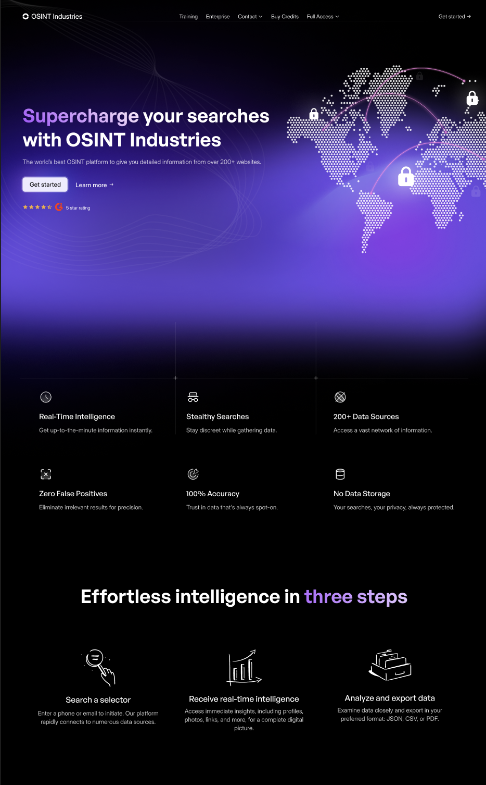
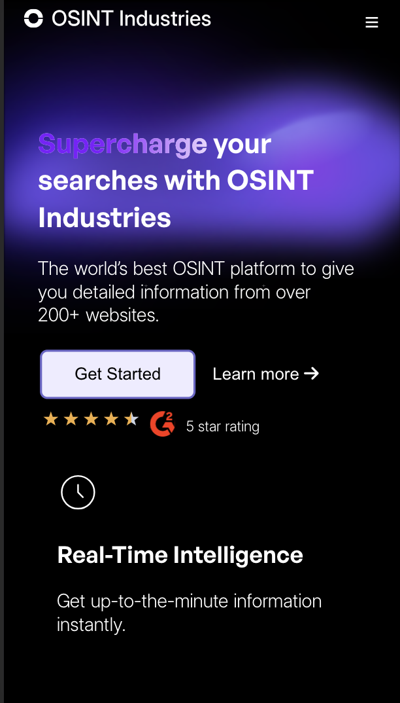
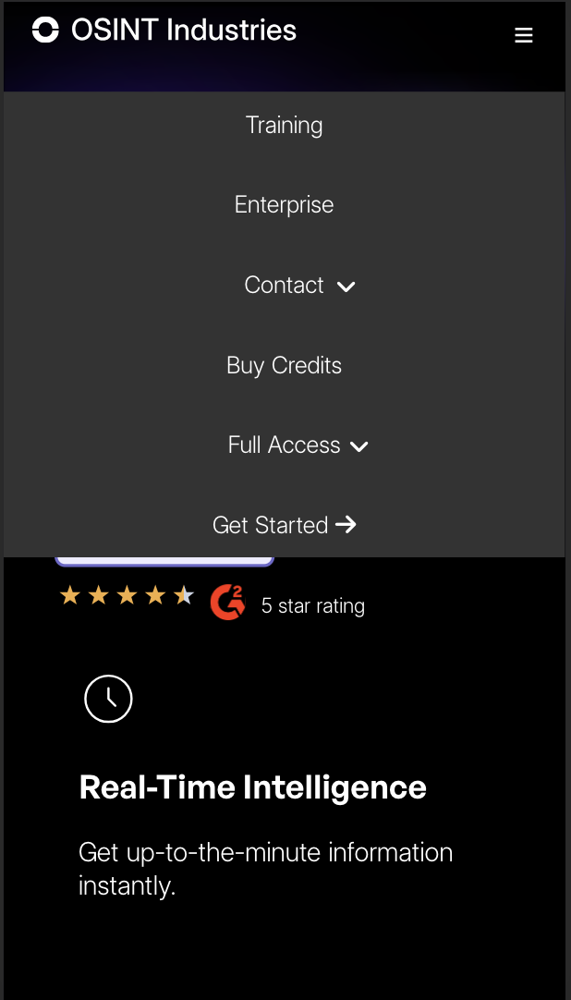
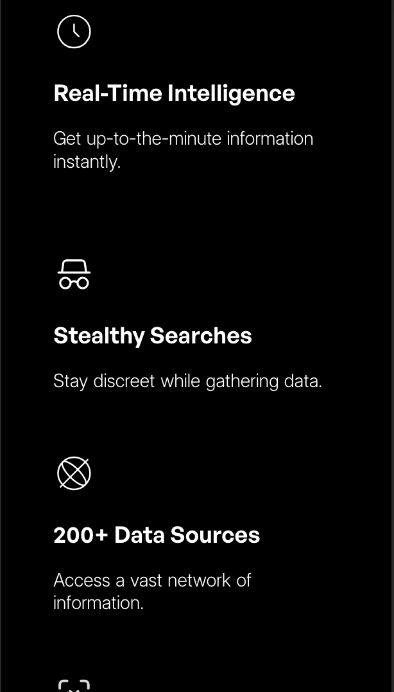
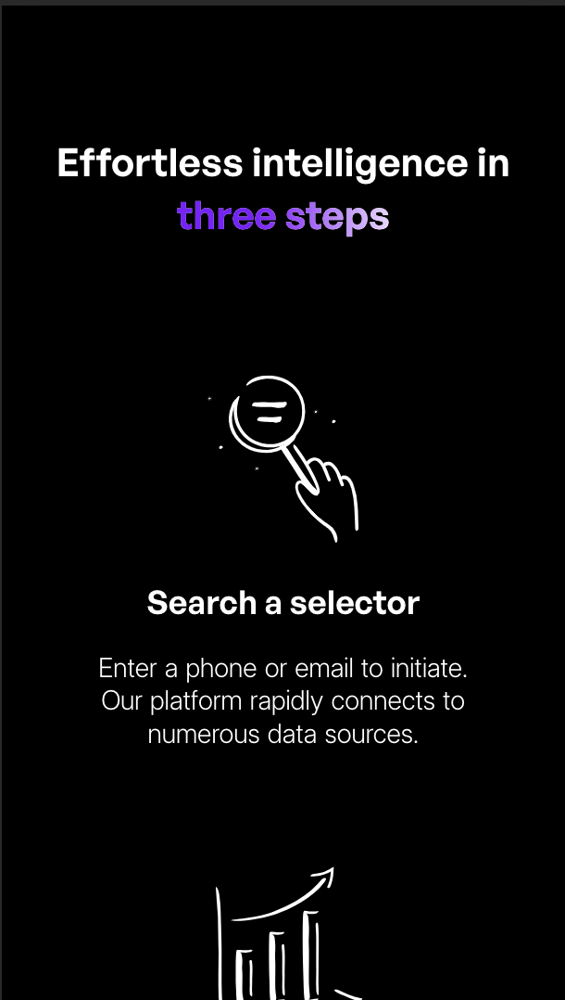
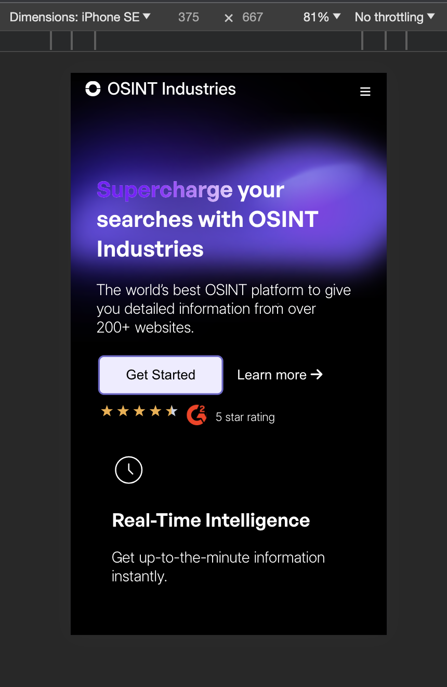

# Project Title

My OSINT ASSESSMENT

## Screenshots
This my home page below, with React, the stylings was done with pure css.  

I also made the screen responsive, below are the mobile views.

Description of the second screenshot.

Iphone SE Edition view below 

## Assessment

I deployed my assessment here: [Assessment Link](https://707a6e93.osintassessment.pages.dev/)

Time duration for assessment : 2 Days

## Installation

To run project, please run npm i and npm start

